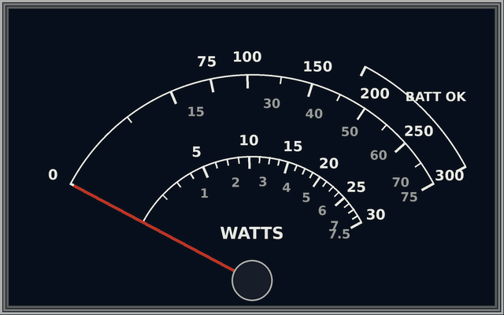

# Bi-directional Power Meter

## The Idea
As a professional I designed IoT RF products, mostly 870MHz and higher. As a licensed HAM operator I use Software Defined Radio (e.g., ADI Pluto) and had commercial rig's from Yeasu and Kenwood.

One thing that was missing was a Bird, HP or R&S like Power Meter. Most surplus meters are without the measurement head/probe as these are costly and easy to blow up (attenuation first!).

Already build systems that used the AD8307 for power measurement up to 500MHz. Also used the AD8302 to build a VNA like sensor for soil impedance measurements.

