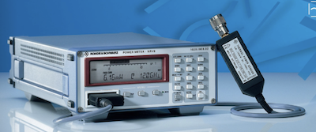
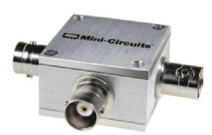
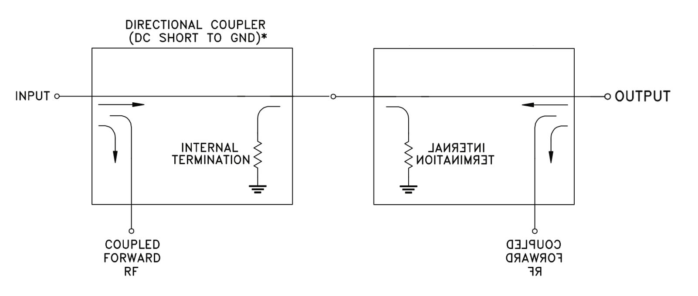
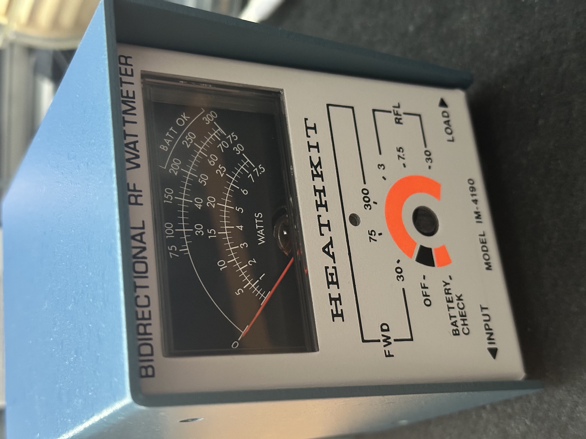
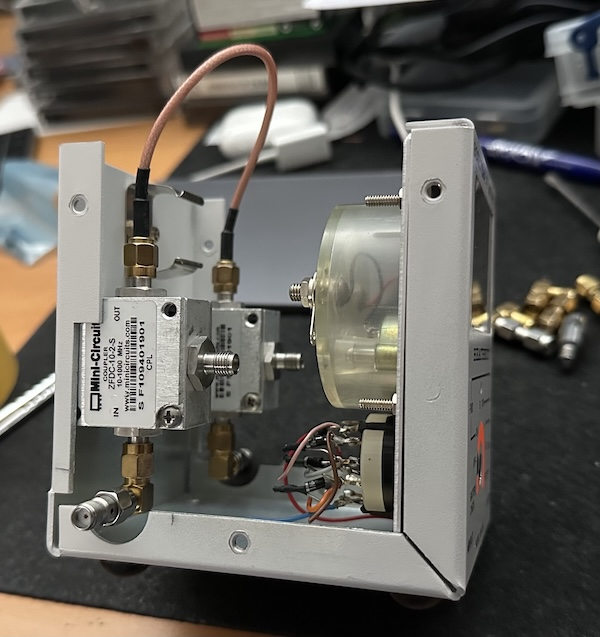
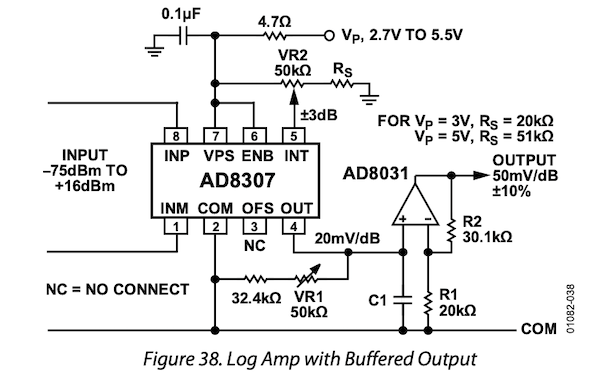

# Bi-directional Power Meter

## The Idea
As a professional I designed IoT RF products, mostly 870MHz and higher. As a licensed HAM operator I use Software Defined Radio (e.g., ADI Pluto) and had commercial rig's from Yeasu and Kenwood.

One thing that was missing was a **Bird**, **HP** or **R&S** like Power Meter. Most surplus meters are without the measurement head/probe as these are costly and easy to blow up (attenuation first!).

Already build systems that used the AD8307 for power measurement up to 500MHz. Also used the AD8302 to build a VNA like sensor for soil impedance measurements. So why not build my own power meter.

### Measurement Bridge
To measure the forward and backward power a stripline pickup at both sides of a PCB could be used.

.png)

But this time I use Mini-Circuits **ZFDC-10-2-S** 10-1000MHz 10dB Directional Couplers.

### Bi-directional Bridge

By combining two Mini-Circuits `ZFDC-10-2-S` I have my measurement bridge with higher quality than D-I-Y.

### IM-4190 Revisited
I got hold of a IM-4190 without the bridge, but the housing, meter and some of the original parts.

The meter is an analog panel 100uA meter at full scale. The rotary switch is not the original, but another 8 position switch. However, the shaft is to short so that it needs to be modified. It probably is the best to tap some 3mm thread in the shaft and extend it by adding a modified standoff. Enfin, details will follow later.

The Mini-Circuits coupler are placed within the enclosure in such a way no real modification is necessary yet. Measurements will determine if the coupling with the cable needs to be replaced by a male-male connector stub. The room around the in/out connector needs a grommet or a 3D printed support.

### Detector
There are a lot of detectors. Lets capture a few in a table:

| Part number      | Description                                                    | Price MOQ=1 |
|------------------|----------------------------------------------------------------|-------------|
| [AD8302ARUZ-RL7](/datasheets/AD8302.pdf)   | RF Gain/Phase Detector, 0 to 2.7GHz, -60 to 0 dBm, TSSOP-14    | € 32.85     | 
| [AD8307ARZ](/datasheets/AD8307.pdf)        | Log Amplifier, 92 dB, 500mV / Decade, 500 ns, NSOIC-8          | € 20.36     |
| [AD8313ARMZ-REEL7](/datasheets/AD8313.pdf) | Log Detector, 100MHz-2.5GHz, -65 TO 0dBm, MSOP-8               | € 32.50     |
| [ADL5513ACPZ-R7](/datasheets/ADL5513.pdf)   | Log Detector, 1MHz-4GHz, -67 to 8dBm, LFCSP-EP-1               | € 16.94     |
| [ADL5519ACPZ-R7](/datasheets/ADL5519.pdf)   | Dual Log Detector, 1MHz-10GHz, -60 to 0dBm, LFCSP-EP           | € 14.49     |

Although the AD8302/8307 are in my junkbox, the design will focus on the ADL5513/ADL5519 due to the interesting price level.

## Power Measurement for the masses
A RF Power Meter is not an measurement device that comes cheap. Besides the already mentioned Bird, HP and R&S Power Measurement Equipment, nowadays RF-in USB-out Power Meters are increasingly populair. However, they are still costly devices.

Most engineers have a DVM or multimeter on their bench. They can measure Voltage, Current and Power. Usually a multi-meter is not capable to measure RF. Therefore an accessory for the multi-meter could de wonders.

The design is a SMA input RF-power meter that
- Outputs a DC voltage in millivolts that has such a value that it can be easily interpreted as dBm value.
- Furthermore an attempt will be made to provide an USB interface too making it even more interesting.
- Implementing $INSTR/VISA instrument control as a future option.

### Principal Design
Taken from the datasheet from the Analog Devices AD8307 is the schematic below. It almost fulfils the purpose.

VR1 provides a ±10% slope adjustment; VR2 provides a ±3 dB intercept range. With R2 = 4.99 kΩ, the slope is adjustable to 25 mV/dB, allowing the use of a 2.7 V supply. Setting R2 to 80.6 kΩ, it is raised to 100 mV/dB, providing direct reading in decibels on a digital voltmeter. Because a 90 dB range now corresponds to a 9 V swing, a supply of at least this amount is needed for the op amp.

_**\<to be continued...\>**_

Note: the couplers short the DC path.